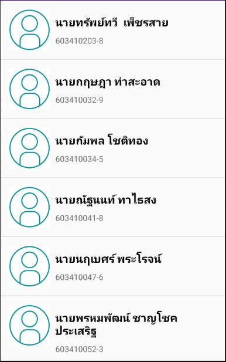
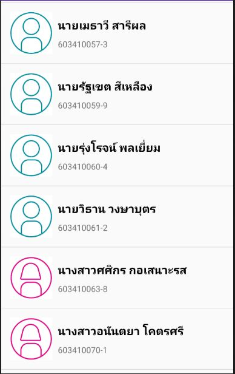
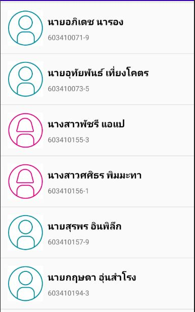
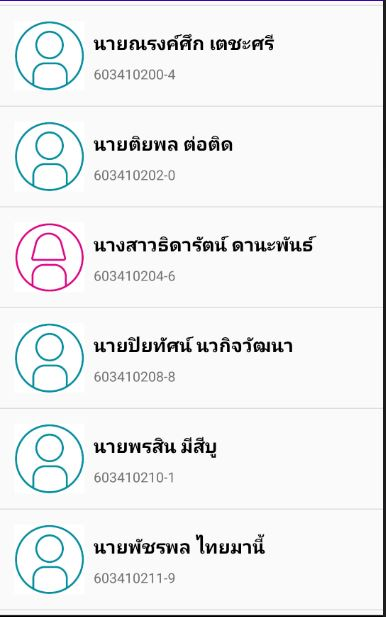
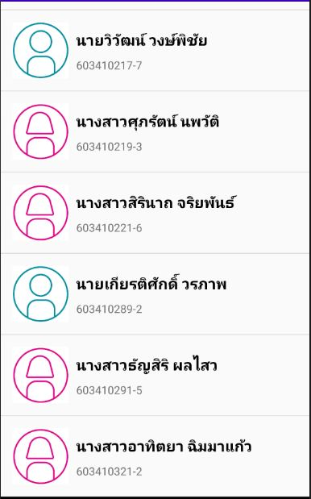
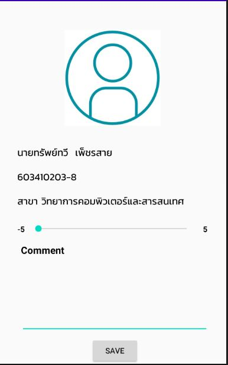
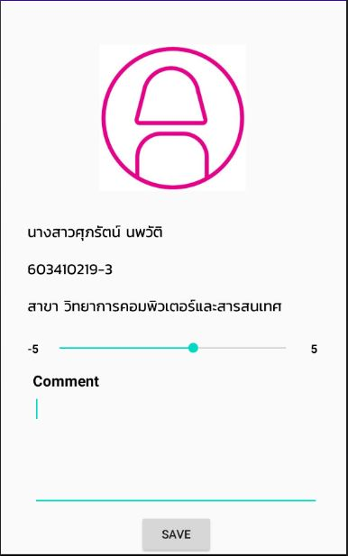
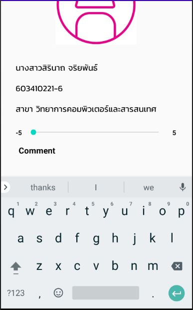

# android-ui-quiz-Zaksapthwee
android-ui-quiz-Zaksapthwee created by GitHub Classroom


## Report UI_QUIZ
_Report สรุป การสอบ Quiz UI_

================================================================

- Project ส่งเวลา 12.59 น. Submit final<br/>
- อัปผลลัพธ์รูปภาพขึ้น Git Submit ผลลัพธ์<br/>
- เผลอลบไปผมก็เลยทำเป็น Report Readme.md ให้ครับ<br/>

:round_pushpin: แสดงรายชื่อ นักศึกษา CIS#3 ทุกคน พร้อมรหัสนักศึกษา






:round_pushpin: นักศึกษาแต่ละคนสามารถกดเข้าไปดูโปรไฟล์และกด SAVE ให้กลับมาหน้าแรกได้







================================================================<br/>
Code EX ตัวอย่าง Code ในไฟล์มีรายชื่อทุกคนที่นี่ [GitHubCode](https://github.com/CISClassroom/android-ui-quiz-Zaksapthwee/blob/master/UI_QUIZ/app/src/main/java/com/example/ui_quiz/CustomListActivity.kt) <br/>
CODE CustomListActivity <br/>
```kotlin
package com.example.ui_quiz

import android.content.Intent
import androidx.appcompat.app.AppCompatActivity
import android.os.Bundle
import android.util.Log
import android.view.View
import android.widget.*
import com.example.ui_quiz.Adapter.StudentAdapter
import com.example.ui_quiz.Model.Students
import kotlinx.android.synthetic.main.activity_custom_list.*

class CustomListActivity : AppCompatActivity() {

    override fun onCreate(savedInstanceState: Bundle?) {
        super.onCreate(savedInstanceState)
        if (supportActionBar != null)
            supportActionBar?.hide()
        setContentView(R.layout.activity_main)
        var  liststudent = mutableListOf<Students>()
        var Students:Students =
            Students(
                "นายทรัพย์ทวี  เพ็ชรสาย",
                "603410203-8",
                "สาขา วิทยาการคอมพิวเตอร์และสารสนเทศ",
                R.drawable.m)
        liststudent.add(Students)
        liststudent.add(Students(
            "นายกฤษฎา ท่าสะอาด",
            "603410032-9",
            "สาขา วิทยาการคอมพิวเตอร์และสารสนเทศ",
            R.drawable.m))
        liststudent.add(Students(
            "นายวิธาน วงษาบุตร",
            "603410061-2",
            "สาขา วิทยาการคอมพิวเตอร์และสารสนเทศ",
            R.drawable.m))
        liststudent.add(Students(
            "นางสาวศศิกร กอเสนาะรส",
            "603410063-8",
            "สาขา วิทยาการคอมพิวเตอร์และสารสนเทศ",
            R.drawable.w))
        liststudent.add(Students(
            "นางสาวอนันตยา โคตรศรี",
            "603410070-1",
            "สาขา วิทยาการคอมพิวเตอร์และสารสนเทศ",
            R.drawable.w))
        liststudent.add(Students(
            "นายอภิเดช นารอง",
            "603410071-9",
            "สาขา วิทยาการคอมพิวเตอร์และสารสนเทศ",
            R.drawable.m))
        liststudent.add(Students(
            "นายอุทัยพันธ์ เที่ยงโคตร",
            "603410073-5",
            "สาขา วิทยาการคอมพิวเตอร์และสารสนเทศ",
            R.drawable.m))
        liststudent.add(Students(
            "นางสาวพัชรี แอแป",
            "603410155-3",
            "สาขา วิทยาการคอมพิวเตอร์และสารสนเทศ",
            R.drawable.w))
        liststudent.add(Students(
            "นางสาวศศิธร พิมมะทา",
            "603410156-1",
            "สาขา วิทยาการคอมพิวเตอร์และสารสนเทศ",
            R.drawable.w)

        liststudent.add(Students(
            "นางสาวธิดารัตน์ ดานะพันธ์",
            "603410204-6",
            "สาขา วิทยาการคอมพิวเตอร์และสารสนเทศ",
            R.drawable.w))
        liststudent.add(Students(
            "นางสาวศุภรัตน์ นพวัติ",
            "603410219-3",
            "สาขา วิทยาการคอมพิวเตอร์และสารสนเทศ",
            R.drawable.w))
        liststudent.add(Students(
            "นางสาวสิรินาถ จริยพันธ์",
            "603410221-6",
            "สาขา วิทยาการคอมพิวเตอร์และสารสนเทศ",
            R.drawable.w))
        liststudent.add(Students(
            "นายเกียรติศักดิ์ วรภาพ",
            "603410289-2",
            "สาขา วิทยาการคอมพิวเตอร์และสารสนเทศ",
            R.drawable.m))
        liststudent.add(Students(
            "นางสาวธัญสิริ ผลไสว",
            "603410291-5",
            "สาขา วิทยาการคอมพิวเตอร์และสารสนเทศ",
            R.drawable.w))
        liststudent.add(Students(
            "นางสาวอาทิตยา ฉิมมาแก้ว",
            "603410321-2",
            "สาขา วิทยาการคอมพิวเตอร์และสารสนเทศ",
            R.drawable.w))
        Log.i("tag",Students.toString())


        var  listView :ListView = findViewById(R.id.Listview) //listview
        listView.adapter = StudentAdapter(this,R.layout.listitem_student,liststudent)
        Listview.setOnItemClickListener { parent: AdapterView<*>, view: View, position:Int, id ->


            //Value of item that is clicked
            val name = liststudent[position].name
            val idstudent = liststudent[position].idstudent
            val major = liststudent[position].major
            val icon = liststudent[position].icon

            //Toast the Values
            Toast.makeText(this,
                "รหัสนักศึกษา :" +liststudent[position].idstudent+"\nชื่อ :  "+liststudent[position].name, Toast.LENGTH_SHORT).show()

            //Intent
            var profile = Intent(this,Profile_Activity::class.java)
            profile.putExtra("name",name)
            profile.putExtra("idstu",idstudent)
            profile.putExtra("major",major)
            profile.putExtra("icon",icon)
            startActivity(profile)
            Log.i("tag",profile.toString())


        }
    }
}
```

Code : Profile_Activity 
```kotlin
package com.example.ui_quiz

import androidx.appcompat.app.AppCompatActivity
import android.os.Bundle
import android.widget.Button
import android.widget.ImageView
import android.widget.TextView
import android.widget.Toast

class Profile_Activity : AppCompatActivity() {

    override fun onCreate(savedInstanceState: Bundle?) {
        super.onCreate(savedInstanceState)
        if (supportActionBar != null)
            supportActionBar?.hide()
        setContentView(R.layout.activity_profile)
        val bundle = intent.extras

        //get data from activity
        val intent = intent
        val get_name_student = intent.getStringExtra("name")
        val get_idstudent = intent.getStringExtra("idstu")
        val get_major = intent.getStringExtra("major")
        val get_icon = bundle!!.getInt("icon")

        //get ID from view
        val profile = findViewById<ImageView>(R.id.profile)
        val namestudent = findViewById<TextView>(R.id.name)
        val idstudent = findViewById<TextView>(R.id.idstudent)
        val major = findViewById<TextView>(R.id.major)


        profile.setImageResource(get_icon)
        namestudent.text = get_name_student
        idstudent.text = get_idstudent
        major.text = get_major

        val Btn_save = findViewById<Button>(R.id.button_save)
            Btn_save.setOnClickListener {
                finish()
            }
    }
}

```
